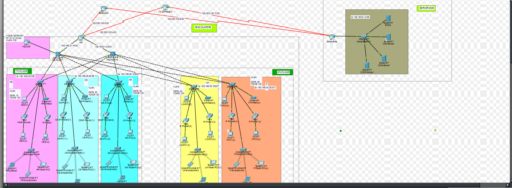

# Secure Multi-Site Enterprise Network

## Project Overview

Designed and implemented a secure, redundant, and scalable enterprise network using Cisco Packet Tracer.

The network connects the HQ across two floors with a separate external Server-Side location hosting DHCP, DNS, Web, and Email services.

The implementation focuses on network segmentation, routing, WAN redundancy, secure inter-site communication, network security, VoIP, wireless connectivity, and centralized network services.

## Network Topology

## Network Architecture

The HQ network includes:

- 2 Multilayer Switches
- 6 Access Switches
- Cisco 2911 HQ Router
- Cisco 2811 Voice Gateway
- Departmental PCs and IP Phones
- Departmental Wireless Access Points
- Dual ISP connections

The external Server-Side network includes:

- Cisco 2911 Router
- DHCP Server
- DNS Server
- Web Server
- Email Server

## Departmental VLANs

| Department | VLAN | Network |
|---|---:|---|
| HR | 10 | 192.168.20.0/26 |
| Customer Service | 20 | 192.168.20.64/26 |
| Marketing | 30 | 192.168.20.128/26 |
| Legal Management | 40 | 192.168.20.192/27 |
| Information Technology | 50 | 192.168.20.224/27 |
| Voice | 120 | 10.10.10.0/24 |

## Technologies Implemented

### Routing & Switching

- VLANs and trunking
- Inter-VLAN Routing
- Multilayer switching
- OSPF Area 0
- IPv4 subnetting
- Hierarchical network design

### WAN & Redundancy

- Dual ISP connectivity
- WAN redundancy and failover
- HQ-to-Server-Side WAN connectivity
- Site-to-site IPsec VPN

### Network Security

- Standard and Extended ACLs
- SSH remote management
- VTY access restrictions
- Switchport Port Security
- Sticky MAC address learning
- VLAN-based network segmentation

### Network Services

- DHCP
- DNS
- Web Server
- Email Server
- NAT/PAT

### VoIP & Wireless

- Cisco 2811 Voice Gateway
- Cisco CME / Telephony Service
- IP phone registration
- Departmental dial plans
- Wireless Access Points
- Departmental wireless networks

## Security Implementation

The network uses multiple security controls to protect users, infrastructure, and inter-site communication.

- ACLs control traffic between network segments.
- SSH provides secure remote device administration.
- VTY access is restricted to authorized IT users.
- Port Security limits switch ports to authorized devices.
- Sticky MAC learning automatically records permitted MAC addresses.
- IPsec VPN encrypts traffic between HQ and the external Server-Side location.

## Testing & Verification

The implementation was tested in Cisco Packet Tracer for:

- Inter-VLAN connectivity
- OSPF neighbor relationships
- Route propagation
- DHCP address allocation
- DNS resolution
- Internet connectivity
- WAN failover
- IP phone connectivity
- Wireless connectivity
- ACL behavior
- SSH access restrictions
- Port Security
- IPsec VPN communication

## Project Files

**Cisco Packet Tracer Project**

`Packet-Tracer/JFSL_Enterprise_Network.pkt`

**Network Topology**

`Topology/JFSL_Network_Topology.png`

## Skills Demonstrated

**Routing & Switching:**  
Cisco IOS, VLANs, Inter-VLAN Routing, OSPF, IPv4 Subnetting, WAN

**Network Security:**  
ACLs, IPsec VPN, SSH, Port Security, Network Segmentation, NAT/PAT

**Infrastructure Services:**  
DHCP, DNS, Web, Email, VoIP/CME, Wireless

**Network Design:**  
Hierarchical Design, Redundancy, Scalability, High Availability, Multi-Site Architecture

## Tools

- Cisco Packet Tracer
- Cisco IOS CLI

## Project Objective

To translate real-world enterprise networking requirements into a functional Cisco network architecture, implement the required routing, switching, security, WAN, VoIP, wireless, and infrastructure services, and validate end-to-end connectivity and redundancy.
